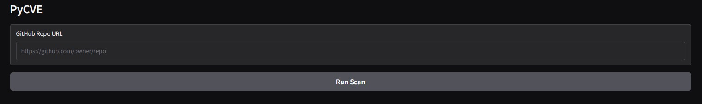

# PyCVE - Python Dependencies CVE Scanner & Auto-Fixer

*Automated vulnerability scanning, fixing, and reporting powered by AI Agents and secure Docker-sandbox execution.*

**🎥 <a href="https://www.youtube.com/watch?v=qRfmXbv8sbQ" target="_blank" rel="noopener noreferrer">Watch Video Demo (No Audio)</a>**


Built with <a href="https://openhands.dev/blog/introducing-the-openhands-software-agent-sdk" target="_blank" rel="noopener noreferrer">OpenHands Software Agent SDK</a>

---

## What is PyCVE?

PyCVE is an intelligent, agent-powered tool that automatically scans Python projects for CVE vulnerabilities and implements fixes with minimal human intervention. Unlike traditional scanners that only identify problems, PyCVE uses AI agents to research, patch, verify, and document security fixes end-to-end.

### The Problem

Today's vulnerability scanning tools like `pip-audit` can identify issues, but fixing them still requires manual effort:
- ✔ Research OSV advisory fix versions from https://osv.dev/
- ✔ Manually update `requirements.txt`
- ✔ Validate environment compatibility
- ✔ Document what changed and why

### The Solution

**AI agents in PyCVE performs the remediation workflow:**

1. **Scan** - Clones your repository, parses `requirements.txt`, runs baseline CVE scans using `pip-audit`
2. **Analyze** - Fetches vulnerability data from OSV database via local MCP server
3. **Fix** - Spawns parallel AI Fixer agents (one per vulnerable package) to update dependencies
4. **Verify** - Runs `pip-audit` again to confirm fixes worked
5. **Document** - Generates detailed reports and patch notes for every change

---

## Key Features

- **Automated Scanning**: Uses `pip-audit` to detect known vulnerabilities in Python dependencies
- **Intelligent Fixing**: AI Fixer agents autonomously implement necessary fixes
- **Parallel Processing**: Multiple packages fixed simultaneously for speed
- **OSV Integration**: Local MCP server enriches vulnerability data using https://osv.dev/
- **Safe Execution**: Docker sandbox prevents contamination of your local environment
- **Detailed Reporting**: Generates comprehensive reports and patch notes for traceability
- **Web Interface**: User-friendly Gradio UI for easy interaction
- **Flexible Models**: Works with any OpenRouter-compatible LLM
  - Validated with `minimax/minimax-m2.1` and `z-ai/glm-4.7`

---

## Architecture Overview

### Two runtime modes

```
═══════════════════════════════════════════════════════════════════════════════════════════════════════════
 DOCKER MODE (COORDINATOR_USE_DOCKER=true)      │    LOCAL MODE (COORDINATOR_USE_DOCKER=false)
═══════════════════════════════════════════════════════════════════════════════════════════════════════════

┌──────────────────────────────────────────┐    │    ┌──────────────────────────────────────────┐
│ CLIENT LAYER (Your Host Machine)         │    │    │ SINGLE PROCESS (Your Host Machine)       │
│                                          │    │    │                                          │
│  Coordinator Agent                       │    │    │  Coordinator Agent                       │
│  ├─ Uses: OPENROUTER_API_KEY             │    │    │  ├─ Uses: OPENROUTER_API_KEY             │
│  ├─ Uses: COORDINATOR_AND_FIXER__MODEL   │    │    │  ├─ Uses: COORDINATOR_AND_FIXER__MODEL   │
│  └─ Creates: Conversation                │    │    │  ├─ Creates: Conversation                │
│              + DockerWorkspace           │    │    │  │           + LocalWorkspace            │
│                                          │    │    │  │                                       │
└──────────────────┬───────────────────────┘    │    │  │  Fixer Agents (in-process)            │
                   │ WebSocket/HTTP             │    │  │  ├─ Share same LLM config             │
                   ↓                            │    │  │  ├─ No isolation                      │
┌──────────────────────────────────────────┐    │    │  │  └─ Direct function calls             │
│ AGENT SERVER LAYER (Docker Containers)   │    │    │  │                                       │
│                                          │    │    │  └─ Workspace: Local filesystem          │
│  pycve-agent-server:mcp container        │    │    │     └─ Cloned repos, requirements.txt    │
│  ├─ Runs: python -m openhands            │    │    │                                          │
│  │         .agent_server                 │    │    │  DOCKER_LLM_* variables IGNORED          │
│  ├─ Uses: DOCKER_LLM_API_KEY             │    │    │                                          │
│  ├─ Uses: DOCKER_LLM_MODEL               │    │    └──────────────────────────────────────────┘
│  ├─ Uses: DOCKER_LLM_BASE_URL            │    │
│  ├─ Uses: DOCKER_LLM_NATIVE_TOOL_CALLING │    │
│  └─ Manages: Fixer agents                │    │
│              with DelegateTool           │    │
│                                          │    │
└──────────────────┬───────────────────────┘    │
                   │                            │
                   ↓                            │
┌──────────────────────────────────────────┐    │
│ WORKSPACE LAYER (Container Filesystem)   │    │
│                                          │    │
│  /workspace (mounted via                 │    │
│              DOCKER_MOUNT_DIR)           │    │
│  ├─ Cloned repos                         │    │
│  ├─ requirements.txt files               │    │
│  └─ Fixer agent operations               │    │
│                                          │    │
└──────────────────────────────────────────┘    │
                                                │
═══════════════════════════════════════════════════════════════════════════════════════════════════════════
```

### Technology Stack

- **Agent Framework**: OpenHands Software Agent SDK
- **MCP Server**: FastMCP with HTTP streamable transport
- **Isolation**: Docker containers for safe execution
- **LLM Provider**: OpenRouter (supports multiple models)
- **UI Framework**: Gradio for web interface

---

## Setup Instructions

### Prerequisites

- **Python 3.12** (required)
- **Docker**
- **OpenRouter API Key** - Get one at https://openrouter.ai/keys
- **uv** (recommended) - Install from https://docs.astral.sh/uv/

### Step 1: Clone the Repository

```bash
git clone https://github.com/edangx100/PyCVE.git
cd PyCVE
```

### Step 2: Create and Activate Python Virtual Environment

**Using uv**

```bash
# Create virtual environment
uv venv .venv --python 3.12

# Activate on Linux/macOS
source .venv/bin/activate
```

### Step 3: Install Dependencies

**Using uv:**
```bash
uv pip install -r requirements.txt
```

### Step 4: Configure Environment Variables

```bash
# Copy example configuration
cp .env.example .env

# Edit .env with your settings
nano .env  # or use your preferred editor
```

**Minimal required configuration:**

```bash
# OpenRouter API Key (required)

OPENROUTER_API_KEY=sk-or-v1-your-key-here

DOCKER_LLM_API_KEY=sk-or-v1-your-key-here

DOCKER_MOUNT_DIR=/path/to/your/PyCVE
```

**Important:** Replace `/path/to/your/PyCVE` with the actual absolute path to your PyCVE directory.

### Step 5: Build Docker Image (Required for Docker runtime Mode, [Two runtime modes](#two-runtime-modes))

If you're using Docker mode (`COORDINATOR_USE_DOCKER=true`), build the custom agent-server image:

```bash
docker build -t pycve-agent-server:mcp -f docker/agent-server/Dockerfile .
```

This image includes:
- Python 3.11 runtime
- OpenHands Agent SDK with DelegateTool support
- Custom Python startup configuration

### Step 6: Start PyCVE

**Recommended: Start MCP Server + Gradio UI**

```bash
./start_pycve.sh
```

This script:
1. Starts the OSV MCP server on http://localhost:3000/mcp
2. Launches the Gradio web interface on http://localhost:7860
3. Runs both in the background for you

**Alternative: Gradio UI Only (if MCP disabled)**

```bash
python app.py      # skip if this was done: ./start_pycve.sh
```

> **Note:** If `OSV_MCP_HTTP_ENABLED=true` in your `.env`, you MUST use `./start_pycve.sh` or the OSV enrichment features won't work.

### Step 7: Verify MCP Server Health (Optional)

```bash
python -m src.mcp_servers.check_mcp_health
```

Expected output:
```
✓ MCP server is running and accessible
```

---

## How to Use PyCVE

### Basic Workflow

1. **Open the Web UI**
   - Navigate to http://localhost:7860 in your browser
   - You'll see the PyCVE Gradio interface

2. **Enter Repository URL**
   - Paste a GitHub repository URL that contains a `requirements.txt` file
   - Example: `https://github.com/edangx100/multi-vuln-repo`

3. **Click "Run Scan"**

   - The scan begins immediately
   - Watch real-time progress through the stages:
     - Preflight validation
     - Repository cloning
     - Requirements parsing
     - Vulnerability scanning
     - Automated fixing (parallel Fixer agents)
     - Post-fix verification
     - Report generation

4. **Download Artifacts**
   - When complete, click the download button
   - Artifacts are saved to `artifacts/<run_id>/`

### Understanding the Output

After each scan, PyCVE generates a comprehensive artifact package:

```
artifacts/<run_id>/
├── SUMMARY.md                    # Human-readable scan summary
├── cve_status.json               # Structured CVE data (before/after/fixed)
├── pip_audit_before.json         # Initial vulnerability scan results
├── pip_audit_after.json          # Post-fix verification results
└── PATCH_NOTES_<package>.md      # Detailed fix notes per package
```

#### Example SUMMARY.md

```markdown
# Vulnerability Scan Summary

**Repository:** https://github.com/example/vulnerable-app
**Scan ID:** abc123-def456
**Date:** 2026-01-01

## Results
- **Vulnerabilities Found:** 5
- **Vulnerabilities Fixed:** 5
- **Vulnerabilities Remaining:** 0

## Fixed Packages
- urllib3: 1.25.11 → 1.26.18 (Fixed CVE-2021-33503)
- requests: 2.25.0 → 2.31.0 (Fixed CVE-2023-32681)
...
```

#### Example PATCH_NOTES_urllib3.md

```markdown
# Patch Notes: urllib3

## Version Change
- **Before:** urllib3==1.25.11
- **After:** urllib3==1.26.18

## Vulnerabilities Fixed
- CVE-2021-33503

## CVE Details (from OSV)
**Summary:** Request splitting vulnerability in urllib3 before 1.26.5

**Affected Versions:** <1.26.5
**Fixed Versions:** >=1.26.5

**Severity:** MODERATE

## Verification
✓ pip-audit confirms no remaining CVEs in urllib3
```

### Testing with Fixtures

PyCVE includes test repositories for validation:

```bash
# Test with a vulnerable repository
# In Gradio UI, use local path:
file:///home/ed/myprojs/PyCVE/fixtures/repo_with_vulns

# Test with a clean repository
file:///home/ed/myprojs/PyCVE/fixtures/no-vuln-repo

# Test with complex directives
file:///home/ed/myprojs/PyCVE/fixtures/repo_with_directives
```

### Advanced Usage

#### Local Mode (No Docker)

You can run without Docker:

```bash
# In .env, set:
COORDINATOR_USE_DOCKER=false

# Start normally
./start_pycve.sh
```

**Pros:** Faster startup, easier debugging
**Cons:** No isolation, runs on your local filesystem

#### Custom Model Selection

Default model used in PyCVE is `minimax/minimax-m2.1`.  
You can switch to a different LLM:

```bash
# In .env, update:
COORDINATOR_AND_FIXER__MODEL = z-ai/glm-4.7  

# For Docker mode, also update:
DOCKER_LLM_MODEL = openrouter/z-ai/glm-4.7
```

See https://openrouter.ai/docs#models for available models.

#### Disable MCP Enrichment

For faster scans without OSV enrichment (from https://osv.dev/):

```bash
# In .env, set:
OSV_MCP_ENABLED=false

# Start with just Gradio
python app.py
```

---

## Troubleshooting

### Common Issues

**Issue:** "MCP port 3000 is already in use"
```bash
# Find process using port 3000
lsof -i :3000 | grep LISTEN || ss -tlnp | grep :3000


# End the process occupying port 3000
kill -9 <PID number>

# Verify port 3000 is free
lsof -i :3000 | grep LISTEN || echo "Port 3000 is now free"

# Restart the server
./scripts/start_osv_mcp_server.sh
```

**Issue:** "Docker build fails"
```bash
# Ensure Docker daemon is running
docker info

# Try rebuilding with no cache
docker build --no-cache -t pycve-agent-server:mcp -f docker/agent-server/Dockerfile .
```

**Issue:** "OpenRouter API authentication failed"
```bash
# Verify your API key
python -m src.validate_openrouter
```

**Issue:** "DOCKER_MOUNT_DIR not found"
```bash
# Use absolute path, not relative
# Bad:  DOCKER_MOUNT_DIR=./PyCVE
# Good: DOCKER_MOUNT_DIR=/home/username/projects/PyCVE
```

### More References

- **Documentation:** See [USER_GUIDE.md](./USER_GUIDE.md) for detailed configuration
- **Logs:** Check `workspace/<run_id>/` for agent execution logs

---

## Project Structure

```
PyCVE/
├── src/
│   ├── agents/
│   │   ├── coordinator/              # Coordinator agent orchestration
│   │   │   ├── coordinator.py        # Main coordinator logic
│   │   │   ├── coordinator_workers.py # Worker processes
│   │   │   ├── artifacts.py          # Artifact generation
│   │   │   ├── audit.py              # pip-audit integration
│   │   │   ├── docker_runtime.py     # Docker workspace management
│   │   │   ├── models.py             # Data models
│   │   │   ├── reporting.py          # Report generation
│   │   │   └── requirements_parser.py # requirements.txt parsing
│   │   └── fixer.py                  # Fixer agent implementation
│   └── mcp_servers/
│       ├── osv_http_server.py        # OSV MCP server (FastMCP)
│       └── check_mcp_health.py       # Health check utility
├── docker/
│   └── agent-server/
│       ├── Dockerfile                # Custom agent-server image
│       └── sitecustomize.py          # Python startup config
├── scripts/
│   └── start_osv_mcp_server.sh       # MCP server launcher
├── fixtures/                          # Test repositories
│   ├── repo_with_directives/
│   ├── repo_with_vulns/
│   └── repo_without_requirements/
├── artifacts/                         # Generated scan outputs
├── workspace/                         # Agent working directories
├── app.py                            # Gradio web UI
├── start_pycve.sh                    # Main launcher script
├── test_e2e_integration.py           # End-to-end integration tests
├── .env.example                      # Configuration template
└── requirements.txt                  # Python dependencies
```

---

## Runtime Modes

PyCVE supports two runtime architectures (see [Two runtime modes](#two-runtime-modes)):

### Docker Mode (Recommended)

```bash
COORDINATOR_USE_DOCKER=true
```

**Architecture:**
- 3-layer system: Client → Agent Server → Workspace
- Containers provide security isolation
- Separate LLM configs for coordinator and fixer agents
- WebSocket communication between layers

**Best for:** Production use, security-critical environments

### Local Mode

```bash
COORDINATOR_USE_DOCKER=false
```

**Architecture:**
- Single-process execution
- All agents run on host machine
- Direct function calls between agents
- No isolation

**Best for:** Development, debugging, testing

---

